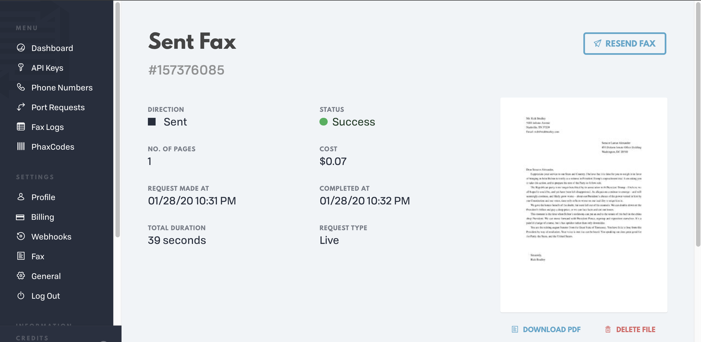

## send a fax, via phaxio.com

Send a file (e.g., a PDF file) to a recipient's fax number via the Phaxio.com API.

Get set up:

 - Go to https://www.phaxio.com/ and create an account
 - Put some money in there; I think it's costing $0.07 per page(?) these days
 - Grab your API keys from https://console.phaxio.com/api_credentials

Install:

```
$ bundle install
```

Set up your environment:

```
$ export PHAXIO_API_KEY=your-key-here
$ export PHAXIO_API_SECRET=your-secret-here
```

Run the script:

```
# usage: bundle exec ruby script/fax.rb <phone-number> <file>
$ bundle exec ruby script/fax.rb 18885551212 ~/Desktop/impeach-trump-senator-dipshit.pdf
```

Check the progress on your dashboard at: https://console.phaxio.com/


